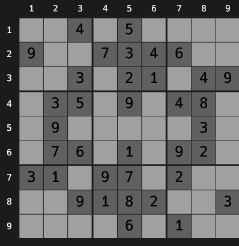
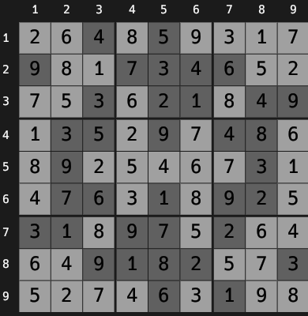
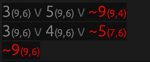
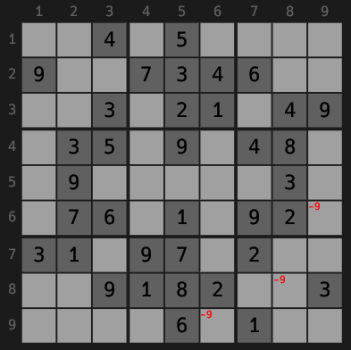
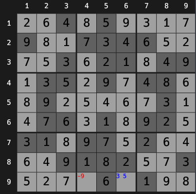
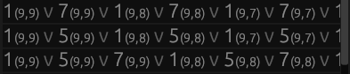

# GUI testing

## Overview

Currently, the actual user-facing functionality (the GUI) is only covered by ad-hoc testing by developers, which is liable to miss problems.
It is also difficult to feel certain that all relevant cases have been covered.
The eventual goal is of course to find a good system for automatic GUI testing, but until then we should improve the reliability of manual testing.
The purpose of this document is to define test cases for manual testing in a way that should provide a good base for automatic testing later.
This way little effort is wasted, and testing is improved as soon as possible.
There should be tests for each user story, and new tests should be added at the same time as new features are merged into `main`.
New tests should also be added as new edge-cases are discovered.

## Structure

The tests will be organized into a nested list structure, where the higher level sections define "setup" actions for lower level ones.
Tests at the same level can be done without repeating the setup steps.
Tests are run in order.
Requirements are checked at the lowest level. For example the structure:

### Tests 1
- Action 1
- Action 2
- **Sub-Tests 1:**
    - Action 3
    - **Require:** Check 1
- **Sub-Tests 2:**
    - Action 4
    - **Require:** Check 2
### Tests 2
- Action 1
- **Sub-Tests 3:**
    - Action 5
    - **Require:** Check 3
- Action 6
- **Sub-Tests 4:**
    - Action 7
    - **Require:** Check 4

Would be run as:
- Action 1
- Action 2
- Action 3
- **Check 1**
- Action 4
- **Check 2**

**QUIT PROGAM**

- Action 1
- Action 5
- **Check 3**
- Action 6
- Action 7
- **Check 4**

## Test cases

### Basic funtions
- Start program with `cargo run`
- Open file `data/sudoku1.txt` with the "Open file..." dialog
- **Check initial state**
    - **Require:** There should be a sudoku grid with clues marked in a different style
    - **Require:** There should be row and col numbers shown beside the grid
    - **Require:** The sudoku grid should be as follows (barring style changes)  
      
- Solve sudoku with the "Solve sudoku" button
- **Check solved state**
    - **Require:** The sudoku grid should be as follows (barring style changes)  
      
    - **Require:** There should be a list of constraints
    - **Require:** There should be 482 constraints
    - **Require:** The start of the list should be as follows (barring style changes)  
      
    - Uncheck "Show solved sudoku"
    - **Require:** The sudoku grid should be as follows (barring style changes)  
      
    - Check "Show solved sudoku"
- **Check length filtering**
    - Enter `3` into the "Max length:" field
    - Press "Filter"
    - **Require:** All constraints should be of length 3 or less
    - **Require:** There should be 30 constraints visible after filtering
    - **Require:** The start of the list should **NOT** have changed  
      
- **Check filtering by cell**
    - Click the cell in row 9, col 6
    - **Require:** The cell should be highlighted
    - **Require:** All constraints should have a value referring to that cell
    - **Require:** There should be 9 constraints visible after filtering
    - **Require:** The start of the list should **NOT** have changed  
      
    - Click the cell in row 9, col 6
    - **Require:** The cell should **NOT** be highlighted
    - **Require:** There should be 30 constraints visible after filtering
    - Click the cell in row 9, col 6
- **Check filter clearing**
    - Press "Clear filters"
    - **Require:** The "Max length:" field should be empty
    - **Require:** No cell should be selected
    - **Require:** There should be 482 constraints
    - **Require:** The start of the list should be as follows (barring style changes)  
    
- **Check constraint visualization**
    - Click on the constraint at the top of the list
    - **Require:** The constraint should be highlighted
    - **Require:** The constraint should be visualized in the sudoku grid  
      
    - Click on the constraint at the top of the list
    - **Require:** The constraint should **NOT** be highlighted
    - **Require:** The constraint should **NOT** be visualized
- **Check constraint paging**
    - **Require:** Clicking on the page change buttons should move between pages
    - **Require:** Moving past the first or last page should not be possible
    - **Require:** The same page (e.g. page 3) should not change as you change back and forth
    - Enter `3` into the "Number of rows per page:" field
    - Press "Select"
    - **Require:** There should be 3 constraints per page
    - **Require:** The start of the list should **NOT** have changed  
      
    - Clear the "Number of rows per page:" field
    - Press "Select"
    - **Require:** All constraints should be on one page
- **Check Solve another sudoku**
    - Open file `data/sample_sudoku.txt.txt` with the "Open file..." dialog
    - Solve sudoku with the "Solve sudoku" button
    - **Require:** The start of the list should be as follows (barring style changes)  
      

### Possible edge cases

#### Constraint selection causing crashes

- Start program with `cargo run`
- Open file `data/sudoku1.txt` with the "Open file..." dialog
- Solve sudoku with the "Solve sudoku" button
- Click on the constraint at the top of the list
- **Require:** The constraint should be highlighted
- **Require:** The constraint should be visualized in the sudoku grid  
  
- **Check length filtering**
    - Enter `3` into the "Max length:" field
    - Press "Filter"
    - **Require:** The constraint should **NOT** be highlighted
    - **Require:** The constraint should **NOT** be visualized
- **Check filtering by cell**
    - Click on the constraint at the top of the list
    - Click the cell in row 9, col 6
    - **Require:** The constraint should **NOT** be highlighted
    - **Require:** The constraint should **NOT** be visualized
- **Check filter clearing**
    - Click on the constraint at the top of the list
    - Press "Clear filters"
    - **Require:** The constraint should **NOT** be highlighted
    - **Require:** The constraint should **NOT** be visualized
- **Check constraint paging**
    - Click on the constraint at the top of the list
    - **Require:** Changing the page should deselect the constraint 
    - Click on the constraint at the top of the list
    - Enter `3` into the "Number of rows per page:" field
    - Press "Select"
    - **Require:** The constraint should **NOT** be highlighted
    - **Require:** The constraint should **NOT** be visualized
- **Check Solve another sudoku**
    - Click on the constraint at the top of the list
    - Open file `data/sudoku1.txt` with the "Open file..." dialog
    - Solve sudoku with the "Solve sudoku" button
    - **Require:** The constraint should **NOT** be highlighted
    - **Require:** The constraint should **NOT** be visualized
